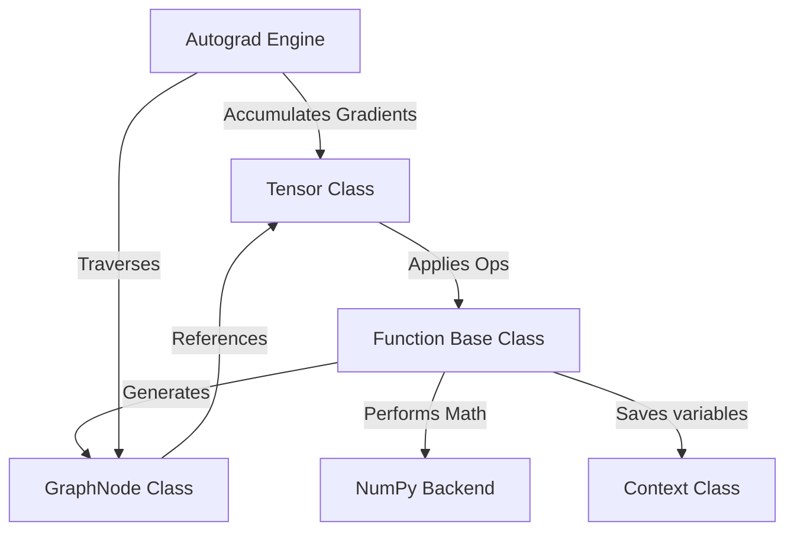

# High-Level Architecture

Gradience is an educational deep learning framework designed to match the API and operational patterns of PyTorch. It relies on a define-by-run paradigm to construct computation graphs on the fly.

## Core Components

The framework is structured into three main layers:

1. **The Autograd Engine (`gradience/autograd/`)**:
   - Manages the tape-based tracking of operations.
   - Computes derivatives using reverse topological traversal of the dynamic graph.

2. **Primitive Operations (`gradience/ops/`)**:
   - Stateless subclasses of `Function` defining the forward and backward passes of math operations.
   - All core math (arithmetic, trigonometry, matrix multiplication) lives here.

3. **Neural Network API (`gradience/nn/`)**:
   - Stateful abstractions (`Module`, `Parameter`, and layers like `Linear`, `BatchNorm1d`, `LayerNorm`, `Dropout`) that compose operations and manage trainable weights.

For detailed information on specific subsystems, consult the **[Internals Documentation](internals/)**:
* **[Tensor Design](internals/tensor.md)**
* **[Autograd Mechanics](internals/autograd.md)**
* **[Module Abstractions](internals/module.md)**
* **[Broadcasting Math](internals/broadcasting.md)**
